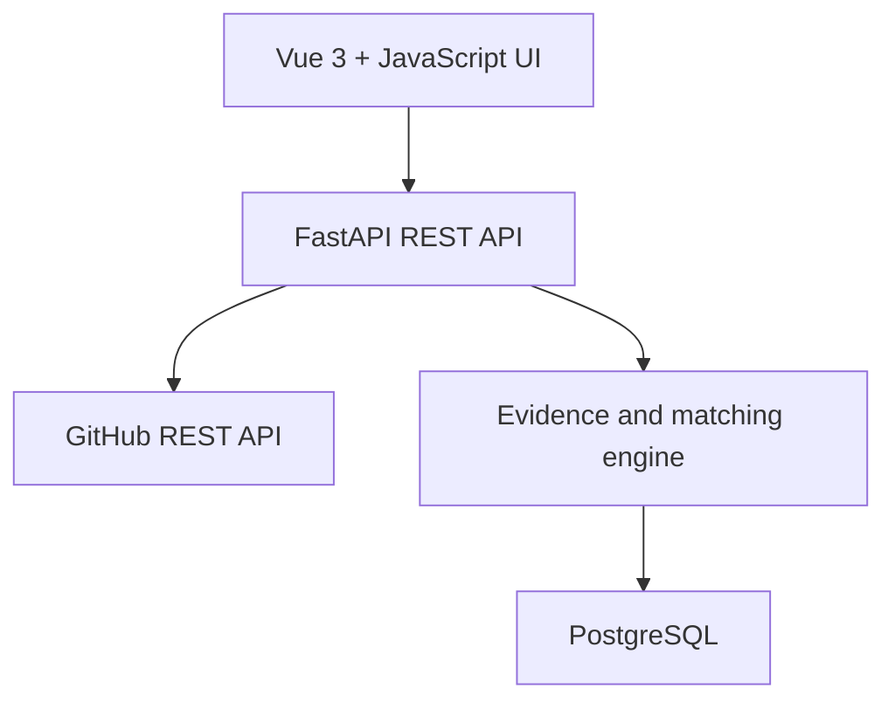

Mr. Stark, the correct move is a rebuild of the application shell—not a mechanical Flask-to-FastAPI translation.

I reviewed both the [AI-agent milestones](sandbox:/workspace/scratch/1904b27be478/upload/SkillProof_AI_Agent_Milestones_Combined.md) and the [Flask implementation plan](sandbox:/workspace/scratch/1904b27be478/upload/SkillProof_Flask_Implementation_Plan.md).

## Recommended architecture



This should be one modular application:

* Vue 3 + plain JavaScript + Vite frontend
* FastAPI owns the API and analysis workflow
* PostgreSQL stores scans, evidence, jobs, reports, and generated claims
* No Spring Boot service inside SkillProof v1
* No separate microservices or Redis/Celery until real measurements justify them

Your existing SteadyMind and Library Management projects already demonstrate Java and Spring Boot. SkillProof should add complementary proof: Python, FastAPI, asynchronous API integration, Vue, PostgreSQL, testing, and system design.

## Phase 1: Assumption autopsy

1. **“Replacing Flask with FastAPI makes the project modern.”**
   False. Renaming Blueprints to routers leaves the same architectural weaknesses.

2. **“Interview-ready means adding JWT, microservices, RAG, Redis and AI.”**
   Portfolio theatre driven by industry fashion and fear. Public-repository scanning needs none of these for the MVP.

3. **“A Flask-focused detector is sufficient.”**
   Inherited from the original plan. It would fail to analyze your Spring Boot and React repositories—the exact projects SkillProof should understand.

4. **“A README keyword proves a skill.”**
   False. Documentation is weak supporting evidence, not implementation proof.

5. **“The repository can be scanned without recording its commit.”**
   False. Repositories change. A report without a commit SHA cannot be reproduced.

6. **“The first 4,000 characters of a file are enough.”**
   An arbitrary implementation shortcut. Evidence may occur later in the file.

7. **“Job fit and repository quality belong in one score.”**
   False. A repository can prove all required skills while having weak documentation, or be beautifully documented while proving none of them.

8. **“Testing can be added near the end.”**
   Borrowed waterfall thinking. The detector and claim generator are the product; their tests must be written with them.

## Phase 2: Irreducible truths

1. Every career claim must trace to exact repository evidence.
2. Every evidence item must trace to a file and immutable commit SHA.
3. A detector must support the stacks used by its target users.
4. Skill matching must be transparent and reproducible.
5. Incomplete scans must be reported as incomplete—not interpreted as absence.
6. External GitHub access is rate-limited and may return truncated trees.
7. Interviewers value defensible decisions and trade-offs more than dependency count.
8. SkillProof’s real product is the provenance chain:

```text
Repository → Commit snapshot → File → Evidence → Match → Generated claim
```

## What remains from the original plan

Keep these product capabilities:

* GitHub URL validation
* Repository metadata and file scanning
* Evidence ledger
* Job-description parsing
* Skill matching
* Repository audit
* Proof-backed resume bullets
* Evidence-based interview talking points
* Report UI
* Testing, documentation and deployment

Replace the Flask-specific implementation:

| Existing design           | FastAPI design                       |
| ------------------------- | ------------------------------------ |
| Flask Blueprints          | `APIRouter` modules                  |
| Flask request/forms       | Pydantic request schemas             |
| Jinja pages               | Vue 3 + JavaScript frontend          |
| Flask-SQLAlchemy          | SQLAlchemy 2.x                       |
| Flask-Migrate             | Alembic                              |
| `requests`                | Async HTTPX client                   |
| Flask configuration       | `pydantic-settings`                  |
| Flask error pages         | Consistent JSON error contract       |
| Gunicorn Flask entrypoint | ASGI deployment with Uvicorn         |
| Flask-only detectors      | Versioned multi-stack detector packs |

FastAPI explicitly positions `APIRouter` as the equivalent of Flask Blueprints and integrates dependency injection and OpenAPI into the application structure. Its official testing workflow uses HTTPX and pytest. [FastAPI application structure](https://fastapi.tiangolo.com/tutorial/bigger-applications/), [dependency injection](https://fastapi.tiangolo.com/tutorial/dependencies/), [testing](https://fastapi.tiangolo.com/tutorial/testing/).

## Proposed technology stack

| Area             | Choice                                               |
| ---------------- | ---------------------------------------------------- |
| Runtime          | Python 3.13                                          |
| API              | FastAPI, Pydantic 2                                  |
| Configuration    | `pydantic-settings`                                  |
| GitHub client    | HTTPX async client                                   |
| Persistence      | PostgreSQL                                           |
| ORM              | SQLAlchemy 2.x with `AsyncSession`                   |
| Migrations       | Alembic                                              |
| Frontend         | Vue 3, JavaScript, Vite                             |
| Testing          | Pytest, HTTPX, pytest-asyncio, respx                 |
| Frontend testing | Vitest, Vue Test Utils, one Playwright flow          |
| Quality          | Ruff, mypy, pre-commit                               |
| Operations       | Docker, Docker Compose, GitHub Actions               |
| Server           | Uvicorn                                              |
| Documentation    | OpenAPI, README, ADRs, architecture and scoring docs |

Use one database session per request or task. SQLAlchemy documents that `AsyncSession` is mutable and must not be shared across concurrent tasks. Concurrent GitHub downloads should complete first, followed by one controlled database transaction. [SQLAlchemy asynchronous ORM](https://docs.sqlalchemy.org/en/latest/orm/extensions/asyncio.html).

## Proposed project structure

```text
skillproof/
├── backend/
│   ├── app/
│   │   ├── main.py
│   │   ├── api/v1/routers/
│   │   ├── core/
│   │   ├── db/
│   │   ├── domain/
│   │   ├── schemas/
│   │   ├── services/
│   │   └── detectors/
│   ├── migrations/
│   ├── tests/
│   │   ├── unit/
│   │   ├── integration/
│   │   ├── contract/
│   │   └── fixtures/
│   └── pyproject.toml
├── frontend/
│   └── src/
│       ├── api/
│       ├── components/
│       ├── features/
│       └── pages/
├── docs/
│   ├── adr/
│   ├── ARCHITECTURE.md
│   ├── EVIDENCE_RULES.md
│   ├── SCORING.md
│   └── INTERVIEW_GUIDE.md
├── docker-compose.yml
└── README.md
```

## Core database model

The original schema should be corrected and extended:

* `Repository`: GitHub identity and metadata
* `Scan`: repository, commit SHA, detector version, status, coverage and timestamps
* `RepoFile`: scan, path, blob SHA, size, purpose and content hash
* `EvidenceItem`: canonical skill, rule ID, file, line range, redacted excerpt and confidence
* `JobDescription`: title, company, text and parser version
* `JobSkill`: canonical skill, required/preferred classification and source sentence
* `MatchReport`: scan, job description, scoring version and separate scores
* `SkillMatch`: exact/equivalent/related/missing result with supporting evidence
* `GeneratedClaim`: resume bullet or interview answer
* `ClaimEvidence`: join table linking every generated claim to evidence

Domain invariant:

```text
A GeneratedClaim cannot be saved without at least one valid EvidenceItem.
```

## Detector strategy

The MVP must be multi-stack from the first release.

Initial detector packs:

1. Python and FastAPI
2. Java and Spring Boot
3. JavaScript, TypeScript and React
4. SQL, PostgreSQL and MySQL
5. Pytest, JUnit, Mockito, Vitest and Jest
6. JWT, Spring Security and authentication patterns
7. Docker and deployment configuration
8. GitHub Actions and CI/CD
9. Documentation and environment configuration

Evidence strength:

* **High:** parsed dependency, import, annotation, class, route, test or configuration
* **Medium:** strong project-structure evidence
* **Low:** README-only reference

Low-confidence evidence appears in the report but does not count as proof in the primary score.

The detector should parse manifests structurally—`pyproject.toml`, `pom.xml`, `build.gradle`, `package.json`—instead of searching every file with broad regular expressions.

## GitHub scanning rules

A scan must:

* Pin the default branch’s current commit SHA
* Cache results by repository + commit SHA + detector version
* Never clone or execute untrusted repository code
* Only communicate with approved GitHub API endpoints
* Skip binaries, generated files, dependencies and minified files
* Apply maximum file-size, file-count and total-byte limits
* Redact secret-like values before persistence
* Record whether the scan was complete or partial
* Handle 403, 404, 422, 429, timeout and network failures explicitly
* Use bounded concurrency rather than launching unlimited requests

GitHub’s unauthenticated REST limit is only 60 requests per hour, and recursively fetched trees can be truncated at 100,000 entries or 7 MB. These are not minor exceptions; they must be represented in the scan result. [GitHub rate limits](https://docs.github.com/rest/using-the-rest-api/rate-limits-for-the-rest-api), [Git Trees API limits](https://docs.github.com/en/rest/git/trees).

For the bounded MVP, `POST /scans` can return `202 Accepted` and use a persisted scan status with FastAPI background processing. A durable worker is postponed until scan volume or reliability requires it; FastAPI itself advises larger queues for heavy cross-process workloads. [FastAPI background tasks](https://fastapi.tiangolo.com/tutorial/background-tasks/).

## Scoring correction

Do not mix job fit with repository polish.

### Job Fit Score

```text
Job Fit = 80% required-skill coverage + 20% preferred-skill coverage
```

Rules:

* Exact and approved equivalent matches count.
* Merely related skills are shown but do not count.
* Low-confidence evidence does not count.
* If the job has no preferred skills, required coverage becomes 100% of the score.
* Every awarded point must expose its evidence and reasoning.
* The scoring formula receives a version number.

### Portfolio Quality Score

Calculated separately from:

* Tests
* Documentation
* Security hygiene
* Deployment readiness
* CI/CD
* Maintainable structure

Before matching, the user can review and correct skills extracted from the job description. This prevents a rule-based parser mistake from silently corrupting the report.

## API contract

| Method  | Endpoint                               | Purpose                           |
| ------- | -------------------------------------- | --------------------------------- |
| `POST`  | `/api/v1/scans`                        | Start repository scan             |
| `GET`   | `/api/v1/scans/{id}`                   | Read scan status and coverage     |
| `GET`   | `/api/v1/scans/{id}/evidence`          | View detected evidence            |
| `POST`  | `/api/v1/job-descriptions`             | Parse a job description           |
| `PATCH` | `/api/v1/job-descriptions/{id}/skills` | Correct extracted skills          |
| `POST`  | `/api/v1/reports`                      | Generate match report             |
| `GET`   | `/api/v1/reports/{id}`                 | Retrieve complete report          |
| `GET`   | `/api/v1/health/live`                  | Process health                    |
| `GET`   | `/api/v1/health/ready`                 | Database and dependency readiness |

## Six-week implementation plan

| Milestone                         | Work                                                                             | Completion gate                                        |
| --------------------------------- | -------------------------------------------------------------------------------- | ------------------------------------------------------ |
| 0. Evidence contract              | Define canonical evidence schema, taxonomy and golden fixtures                   | Expected and forbidden evidence documented             |
| 1. Foundation                     | FastAPI structure, settings, PostgreSQL, Alembic, errors, logging, health and CI | App starts; migration and CI pass                      |
| 2. Provenance model               | Implement repository, scan, file, evidence and claim lineage                     | One claim traces to file and commit                    |
| 3. GitHub ingestion               | URL parser, async client, tree handling, limits, caching and scan states         | Public repository produces reproducible file inventory |
| 4. Detection engine               | Implement the initial multi-stack detector packs                                 | Golden Java, Python and React fixtures pass            |
| 5. Job parser                     | Taxonomy-based extraction, required/preferred classification and correction API  | User can verify extracted requirements                 |
| 6. Matcher                        | Transparent normalization, scoring, evidence mapping and missing-skill analysis  | Every score component is explainable                   |
| 7. Audit and generators           | Quality audit, resume claims and interview cards                                 | Unsupported-claim tests pass                           |
| 8. Vue interface                  | Scan workflow, evidence explorer, JD review and report pages                     | Complete responsive user journey works                 |
| 9. Hardening                      | Security limits, Postgres integration tests, API contract tests and one E2E flow | CI passes; failures are safe and observable            |
| 10. Deployment and interview pack | Docker deployment, diagrams, ADRs, README, screenshots and demo script           | Public demo can be explained in two minutes            |

Estimated implementation: approximately 30 focused working days, leaving room inside the 60-day job target for polishing, applications and mock interviews.

## Interview-ready completion standard

SkillProof is ready only when it has:

* A deployed public demo
* Automatic OpenAPI documentation
* A real PostgreSQL migration history
* Unit, integration, API-contract and frontend tests
* CI enforcing backend type checks plus frontend linting, runtime contracts and tests
* Architecture and database diagrams
* ADRs explaining major decisions
* A scoring document with worked examples
* A documented GitHub rate-limit and truncation strategy
* Test coverage concentrated on the detector, matcher and claim invariant
* A two-minute demonstration using one of your real Spring Boot repositories
* An interview guide covering async I/O, dependency injection, transactions, caching, scoring and security
* Atomic commits and GitHub issues aligned with milestones

## Deliberately excluded from MVP

* User registration and JWT authentication
* GitHub OAuth and private repositories
* LLM-generated bullets
* RAG or vector databases
* Multi-repository portfolio analysis
* Redis, Celery or microservices
* Resume DOCX export
* Recruiter share links

These can only enter after the evidence engine is trustworthy and deployed.

## To Glory

The highest-leverage first action is not creating `main.py`.

Create a frozen **golden evidence corpus** containing:

* A Spring Boot fixture based on Library Management
* A Spring Boot/AI fixture based on SteadyMind
* A React/TypeScript fixture
* A small FastAPI fixture
* Expected evidence for each fixture
* Skills that must **not** be detected
* Exact source paths and line references
* A pinned commit SHA and detector version

That single contract forces the entire architecture to serve the actual product promise: **no evidence, no claim**.

Before implementation begins, the main review decisions are:

1. Vue + FastAPI modular monolith, with no Spring Boot inside SkillProof v1
2. Multi-stack detection in the MVP
3. Separate Job Fit and Portfolio Quality scores
4. Commit-level evidence provenance
5. Six-week scope with authentication and AI deferred
