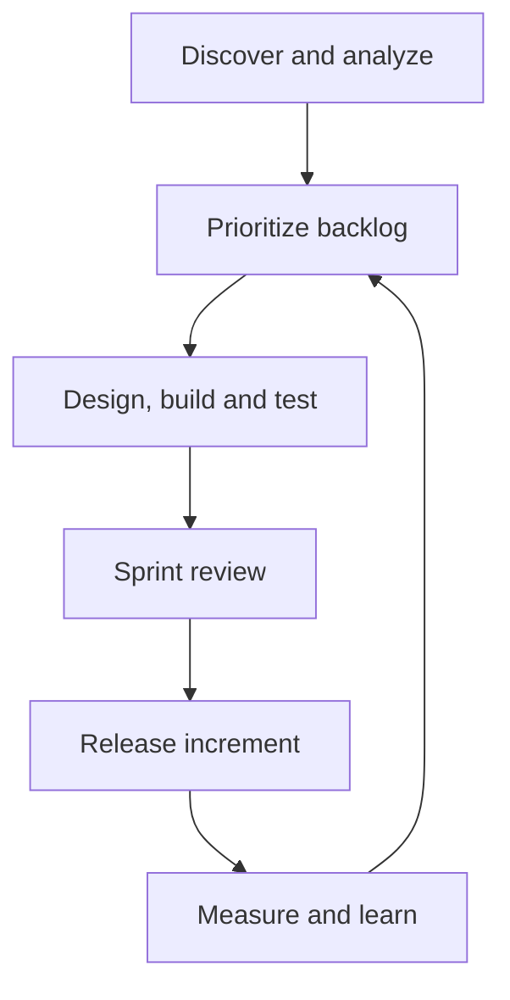

 The best fit for SkillProof is the **Agile Iterative-Incremental SDLC model**, operated with lightweight Scrum and DevOps practices.

If an interviewer asks for one model, say:

> “We used the Agile Iterative-Incremental model because SkillProof contained uncertain components—especially repository detection, evidence confidence and scoring—which had to be validated through working increments and stakeholder feedback.”

## Phase 1: Assumption autopsy

1. **A company selects one textbook model and follows it mechanically.**
   False. Companies combine an SDLC model with delivery and engineering practices.

2. **Agile means little planning or documentation.**
   False. Professional Agile changes documentation continuously instead of freezing it once.

3. **Testing begins after development.**
   False. For SkillProof, detector tests must be written alongside detector rules.

4. **Requirements must be completely known before development.**
   False. We know the product goal, but scoring rules and detection accuracy require experimentation.

5. **Scrum is itself the entire SDLC.**
   Incorrect. Scrum manages delivery cadence. It does not replace requirements analysis, architecture, testing, deployment or maintenance.

6. **More meetings make the project company-grade.**
   Corporate theatre. Traceability, quality gates and predictable delivery matter more than ceremonies.

## Phase 2: Irreducible truths

1. SkillProof’s core business rule is stable: **no evidence, no claim**.
2. The exact detector and scoring implementation will evolve through testing.
3. GitHub API behaviour introduces external risk.
4. The product can be delivered as independent working increments.
5. User feedback is required before the report format and scoring are final.
6. Every increment must remain deployable and testable.
7. Therefore, a sequential Waterfall process would expose major errors too late.

## The selected operating model

| Concern            | Selected approach                                        |
| ------------------ | -------------------------------------------------------- |
| Primary SDLC model | Agile Iterative-Incremental                              |
| Team workflow      | Lightweight Scrum or Scrumban                            |
| Iteration length   | One or two weeks                                         |
| Engineering model  | DevOps with CI/CD                                        |
| Testing approach   | Shift-left testing with requirement-to-test traceability |
| Risk management    | Technical spikes during project inception                |
| Release strategy   | Small, working vertical increments                       |



## How a company would run SkillProof through the SDLC

### 1. Business discovery and problem definition

The company begins with the business problem, not FastAPI.

Business problem:

> Developers claim skills on resumes, but recruiters cannot easily verify those claims against repository evidence.

Stakeholders:

* Fresher and junior developers
* Recruiters
* Placement mentors
* Resume reviewers
* Engineering interviewers

Initial success criteria:

* A user can scan a public GitHub repository.
* Detected skills include exact supporting evidence.
* A job description can be parsed and corrected.
* Job fit and portfolio quality are reported separately.
* Generated bullets never contain unsupported claims.
* The application is publicly deployable.

Company outputs:

* Product vision
* Problem statement
* Target-user definition
* MVP boundary
* Initial success metrics
* Stakeholder list

Exit gate:

> Stakeholders agree on the problem, target user and MVP—not necessarily every implementation detail.

### 2. Feasibility and risk analysis

Before committing to full development, the technical lead runs short experiments called technical spikes.

SkillProof spikes:

1. Can the GitHub API retrieve enough source evidence without cloning repositories?
2. Can Spring Boot, FastAPI and React dependencies be detected reliably?
3. Can evidence be linked to a commit, file and line range?
4. How often does the GitHub tree response become incomplete?
5. Can the system redact possible secrets safely?
6. How long does a representative scan take?
7. Can rule-based job parsing produce acceptable results?

Primary risks:

| Risk                      | Company response                              |
| ------------------------- | --------------------------------------------- |
| False-positive skills     | Golden fixtures and forbidden-evidence tests  |
| Missing repository files  | Coverage and partial-scan indicators          |
| GitHub rate limits        | Authentication, caching and request budgeting |
| Unsupported resume claims | Claim-to-evidence domain invariant            |
| Changing repositories     | Pin every scan to a commit SHA                |
| Misclassified job skills  | Human review and correction step              |
| Scope expansion           | Explicit post-MVP backlog                     |

Company outputs:

* Feasibility report
* Prototype or spike code
* Risk register
* Initial estimates
* Go/no-go decision

### 3. Requirements analysis

A product owner and business analyst convert the vision into requirements.

#### Functional requirements

Examples:

```text
FR-01: User can submit a public GitHub repository URL.
FR-02: System records the repository's commit SHA.
FR-03: System extracts technical evidence from selected files.
FR-04: Every evidence item includes its source file.
FR-05: User can submit a job description.
FR-06: User can correct extracted required and preferred skills.
FR-07: System generates an explainable job-fit report.
FR-08: Resume bullets must reference evidence items.
FR-09: System shows whether a scan was complete or partial.
```

#### Non-functional requirements

Examples:

```text
NFR-01: The application must never execute repository code.
NFR-02: Secret-like values must not be exposed.
NFR-03: API responses must follow a consistent error format.
NFR-04: Scanning must use bounded file and request limits.
NFR-05: Core scoring must be deterministic and reproducible.
NFR-06: Database changes must use versioned migrations.
NFR-07: Critical domain services must have automated tests.
```

#### User story example

```text
As a job applicant,
I want to see the exact repository evidence behind a detected skill,
so that I can defend that skill during an interview.
```

Acceptance criteria:

```text
Given a repository containing a Spring Boot controller,
when the repository is scanned,
then Spring Boot evidence is created,
and the evidence contains the commit SHA, path, rule and source excerpt.
```

Company outputs:

* Product backlog
* User stories
* Acceptance criteria
* Non-functional requirements
* Requirement traceability matrix

### 4. Architecture and system design

The engineering lead produces enough design to prevent structural mistakes without designing every future feature.

Design artifacts:

* System architecture diagram
* Database ER diagram
* OpenAPI contract
* Evidence schema
* Detector rule structure
* Scoring specification
* Threat model
* UI wireframes
* Architecture Decision Records

Important ADRs:

```text
ADR-001: Why FastAPI instead of Flask
ADR-002: Why the Vue client is separated from the API
ADR-003: Why rule-based detection precedes AI
ADR-004: Why job fit and repository quality are separate scores
ADR-005: Why every scan is pinned to a commit
ADR-006: Why Celery and Redis are deferred
```

Architecture review gate:

* Product requirements are supported.
* Security boundaries are understood.
* Database relationships are valid.
* API contracts are reviewable.
* No unnecessary distributed architecture exists.

### 5. Backlog prioritization and release planning

The product owner prioritizes work by business value and technical dependency.

Priority order:

1. Evidence integrity
2. Repository ingestion
3. Multi-stack detection
4. Job parsing
5. Matching and scoring
6. Proof-backed claims
7. User interface
8. Deployment and polish

Each backlog item should contain:

* Business value
* Description
* Acceptance criteria
* Technical notes
* Test expectations
* Dependencies
* Estimate
* Priority

The company should use a vertical-slice strategy. A sprint should produce something demonstrable, not merely “all database work” or “all frontend work.”

## Proposed sprint structure

### Inception: three to five days

Activities:

* Confirm product scope
* Build golden repository fixtures
* Complete technical spikes
* Define architecture
* Write the first ADRs
* Create the initial backlog
* Establish CI and Definition of Done

Result:

> The company knows what it is building, what could fail and how success will be measured.

### Sprint 1: Repository-to-evidence slice

Build:

* FastAPI foundation
* PostgreSQL and Alembic
* GitHub URL validation
* Repository metadata retrieval
* Commit-pinned scanning
* Initial Java/Spring Boot detector
* Evidence API
* Basic evidence UI

Sprint demonstration:

> Submit the Library Management repository and display Spring Boot evidence linked to exact files.

### Sprint 2: Multi-stack proof engine

Build:

* Python/FastAPI detector pack
* React/TypeScript detector pack
* Database, testing and deployment detectors
* Confidence rules
* Partial-scan reporting
* Detector-version tracking
* Golden-fixture regression suite

Sprint demonstration:

> Scan Java, Python and React fixtures without generating forbidden skills.

### Sprint 3: Job-fit workflow

Build:

* Job-description parser
* Required/preferred classification
* Skill-correction interface
* Normalization rules
* Matching engine
* Separate Job Fit and Portfolio Quality scores
* Explainable match results

Sprint demonstration:

> Paste a real job description and explain exactly why every skill was matched, related or missing.

### Sprint 4: Career-output workflow

Build:

* Repository quality audit
* Resume bullet generator
* Interview-answer generator
* Claim-to-evidence associations
* Unsupported-claim tests
* Complete report interface

Sprint demonstration:

> Show a bullet, open its evidence and prove that removing the evidence prevents the bullet from being generated.

### Sprint 5: Production hardening

Build:

* API error contract
* Rate-limit handling
* Secret redaction
* Structured logging
* Health endpoints
* Integration and end-to-end tests
* Docker deployment
* Staging environment
* Documentation and demo data

Sprint demonstration:

> Execute the complete workflow on the staging deployment.

### Sprint 6: Release and interview preparation

Complete:

* User acceptance testing
* Accessibility and responsive review
* Regression testing
* Performance baseline
* Production deployment
* README and diagrams
* Interview guide
* Two-minute demo script
* Known limitations
* Future roadmap

Release gate:

> The complete product works, tests pass, the evidence invariant holds, rollback is possible and the system can be explained clearly.

## What happens inside every sprint

A professional sprint is not simply “write code for two weeks.”

### Sprint planning

The team selects stories based on:

* Business priority
* Team capacity
* Dependencies
* Risks
* Previous sprint results

### Design refinement

Engineers clarify:

* API request and response schemas
* Database changes
* edge cases
* security implications
* testing strategy

### Development workflow

```text
Backlog story
→ short-lived branch
→ implementation and tests
→ pull request
→ automated CI
→ code review
→ merge
→ staging deployment
```

### Continuous testing

Every pull request runs:

* Unit tests
* Integration tests where applicable
* Linting
* Type checking
* Migration validation
* Security and dependency checks
* Frontend build
* API contract checks

### Sprint review

The team demonstrates working software to stakeholders.

Stakeholders evaluate:

* Does it solve the user story?
* Is the output understandable?
* Is the evidence trustworthy?
* Should priorities change?

### Retrospective

The team asks:

* What slowed delivery?
* Which assumptions were wrong?
* Which defects escaped?
* What should change in the next sprint?

## Company roles

| Role              | SkillProof responsibility                      |
| ----------------- | ---------------------------------------------- |
| Product owner     | Owns vision, priorities and acceptance         |
| Business analyst  | Defines requirements and workflows             |
| Technical lead    | Owns architecture and major trade-offs         |
| Backend engineer  | Builds FastAPI, database and analysis engine   |
| Frontend engineer | Builds Vue workflow and report interface       |
| QA/SDET           | Designs regression, integration and E2E tests  |
| DevOps engineer   | Owns CI/CD, environments and observability     |
| Security reviewer | Reviews tokens, input limits and data exposure |
| Stakeholder/user  | Performs acceptance testing                    |

If you build it alone, you wear every role—but should still produce the important artifacts.

## Definition of Done

A story is not complete merely because it works locally.

For SkillProof, every story is done only when:

* Acceptance criteria pass.
* Unit tests cover the business behaviour.
* Integration tests cover external or database boundaries.
* Code passes linting and type checking.
* Pull-request review is complete.
* OpenAPI and documentation are updated.
* Database migration exists when required.
* Errors are logged without exposing secrets.
* Feature is demonstrated in staging.
* No unsupported claim can be produced.

## Production release process

A company normally uses separate environments:

```text
Development → Test/CI → Staging → Production
```

Before production:

* Freeze the release candidate.
* Run regression tests.
* Test database migrations.
* Execute security checks.
* Perform stakeholder acceptance.
* Prepare release notes.
* Confirm monitoring and rollback.
* Deploy production.
* Run smoke tests.

A failed smoke test triggers rollback rather than emergency editing in production.

## Operations and maintenance

The SDLC does not end after deployment.

The company monitors:

* Successful and failed scans
* Scan duration
* GitHub API request usage
* Partial-scan frequency
* Detector false-positive reports
* Report-generation failures
* Application errors
* Database health

Feedback becomes backlog items:

* Production defect → prioritized bug
* New framework detector → feature story
* Architectural change → ADR
* Security issue → expedited fix
* AI/RAG suggestion → post-MVP evaluation

## Why other SDLC models are weaker here

| Model                       | Verdict                                                               |
| --------------------------- | --------------------------------------------------------------------- |
| Waterfall                   | Too rigid; detection and scoring problems would appear late           |
| V-Model                     | Strong verification, but requirements are not stable enough           |
| Spiral                      | Good for extreme risk, but excessive overhead for this project        |
| Prototyping                 | Useful during inception, but insufficient for full delivery           |
| Big Bang                    | No predictable scope, quality or release control                      |
| Pure Scrum                  | Scrum is a delivery framework, not the complete engineering lifecycle |
| Agile Iterative-Incremental | Best balance of feedback, control, testing and incremental delivery   |

We should borrow **traceability discipline from the V-Model** and **risk spikes from Spiral**, but the governing model remains Agile Iterative-Incremental.

## Interview-ready explanation

> “SkillProof followed an Agile Iterative-Incremental SDLC. We first validated the highest-risk assumption: whether repository skills could be detected with traceable evidence. We then delivered vertical increments—repository scanning, multi-stack detection, job matching, evidence-backed outputs and production hardening. Each story had acceptance criteria and automated tests, and every sprint ended with a deployable demonstration. We used CI/CD and shift-left testing throughout rather than treating testing and deployment as final phases.”

## To Glory

The highest-leverage SDLC action is to create a traceability chain before Sprint 1:

```text
Business requirement
→ User story
→ Acceptance criteria
→ Implementation
→ Automated test
→ Demonstrable product evidence
```

For SkillProof’s central rule, it would be:

```text
Requirement:
No unsupported career claim may be generated.

Acceptance:
Every generated claim has at least one evidence association.

Tests:
Claim creation fails when evidence is empty.
Deleting evidence invalidates dependent claim generation.

Release gate:
The unsupported-claim test suite must pass before deployment.
```

That is what makes the process company-grade: not meetings, not terminology, but provable control from requirement to production.
