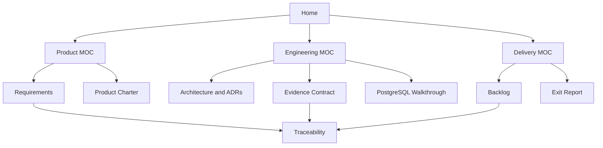

# SkillProof Documentation Home

> [!abstract] Product promise
> SkillProof turns public repository implementation evidence into explainable skill matches and career claims. **No evidence, no claim.**

> [!success] Current delivery state
> Phase 1 inception is complete with a controlled **GO to Sprint 1**. The [[guides/Vue Frontend Walkthrough|Vue 3 plain-JavaScript client]] and [[guides/PostgreSQL Implementation Walkthrough|PostgreSQL evidence-ledger foundation]] now anchor the repository-to-evidence vertical slice.

## Start here

1. Open [[MOCs/Project MOC|Project MOC]] for the complete knowledge map.
2. Read [[inception/PHASE_1_EXIT_REPORT|Phase 1 Exit Report]] for the go/no-go evidence.
3. Follow [[guides/PostgreSQL Implementation Walkthrough|PostgreSQL Implementation Walkthrough]] to run the database-backed API foundation.
4. Follow [[guides/Vue Frontend Walkthrough|Vue Frontend Walkthrough]] to review the browser implementation.
5. Use [[inception/BACKLOG|Sprint 1 Backlog]] as the delivery source of truth.
6. Follow [[guides/GitHub Repository Setup|GitHub Repository Setup]] to publish and govern the project safely.
7. Consult [[inception/REQUIREMENTS|MVP Requirements]] and [[inception/EVIDENCE_CONTRACT|Evidence Contract 0.1]] before changing behavior.
8. Read [[OBSIDIAN_GUIDE|Obsidian Guide]] before adding or reorganizing notes.

## Knowledge map

## Maps of content

| Area | Open when you need to… |
| --- | --- |
| [[MOCs/Product MOC|Product]] | Understand users, scope, requirements, scoring, risks, or product decisions |
| [[MOCs/Engineering MOC|Engineering]] | Work with architecture, APIs, data, evidence rules, security, or ADRs |
| [[MOCs/Delivery MOC|Delivery]] | Plan and execute spikes, stories, tests, reviews, and releases |
| [[MOCs/Project MOC|Project]] | Navigate across all domains and find the current source of truth |

## Project controls

- Requirements and acceptance criteria: [[inception/REQUIREMENTS]]
- Active risk treatments: [[inception/RISK_REGISTER]]
- Approved decisions: [[inception/DECISION_LOG]]
- Requirement-to-test coverage: [[inception/TRACEABILITY_MATRIX]]
- API boundary: [[inception/API_CONTRACT]]
- Data invariants: [[inception/DATA_MODEL]]
- Architecture decisions: [[adr/README|ADR Index]]
- Repository publication and governance: [[guides/GitHub Repository Setup]]
- Frontend implementation walkthrough: [[guides/Vue Frontend Walkthrough]]
- PostgreSQL implementation and operations: [[guides/PostgreSQL Implementation Walkthrough]]

## Working notes

- Create structured notes from [[templates/General Note|templates]].
- Record daily context in [[journal/README|Journal]].
- Store pasted images and other files in `assets/attachments`.
- Keep unfinished notes discoverable with `status: draft`; do not place decisions only in daily or meeting notes.

## Related notes

- [[OBSIDIAN_GUIDE]]
- [[guides/PostgreSQL Implementation Walkthrough]]
- [[guides/GitHub Repository Setup]]
- [[inception/README|Inception Baseline]]
- [[adr/README|Architecture Decision Records]]
