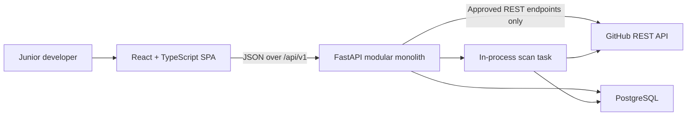

# SkillProof Architecture

**Status:** Accepted for MVP implementation  
**Architecture version:** `0.1`  
**Last updated:** 2026-07-15

## 1. Purpose and architectural drivers

SkillProof analyzes a public GitHub repository and turns implementation evidence into explainable skill matches and career outputs. Its governing invariant is:

> No evidence, no claim.

The architecture is optimized for these drivers, in priority order:

1. Evidence and claim provenance must be inspectable and reproducible.
2. Untrusted repository content must never be executed.
3. Incomplete analysis must remain distinguishable from skill absence.
4. Detection and scoring must be deterministic and versioned.
5. A solo developer must be able to build, operate, and explain the system.
6. The MVP must remain easy to split into durable workers only when measured load requires it.

The initial detector scope is Python, FastAPI, Pytest, TypeScript, React, Vite, and Vitest. Authentication, private repositories, AI/LLM generation, Redis, Celery, microservices, and additional detector packs are outside v1.

## 2. System context



SkillProof has two deployable application artifacts: a static frontend and one API process. The API is a modular monolith: its modules have explicit responsibilities but share one release, one PostgreSQL database, and one versioned API contract. The frontend never calls GitHub directly.

## 3. Logical components

| Component | Responsibility | Must not do |
| --- | --- | --- |
| React application | Repository submission, scan status, evidence inspection, job-skill correction, and report presentation | Hold GitHub credentials, infer proof, or calculate authoritative scores |
| HTTP API | Validate requests, enforce response contracts, create resources, authorize workflow transitions, and attach request IDs | Perform long GitHub scans inside an HTTP request |
| Scan coordinator | Persist scan state, schedule work, reconcile interrupted v1 tasks, and expose progress | Share a request-scoped database session with a background task |
| GitHub gateway | Resolve repository identity/default branch/commit, enumerate blobs, retrieve bounded text, and translate GitHub failures | Clone repositories, follow arbitrary URLs, or execute content |
| Ingestion pipeline | Classify files, enforce limits, normalize text, redact secrets, and compute content hashes | Persist raw secrets or unbounded source content |
| Detector engine | Run versioned, deterministic rules and produce candidate evidence | Award skill proof from README-only references |
| Evidence service | Validate and persist evidence contract `0.1`, enforce provenance, and serve evidence queries | Create evidence without a pinned commit and line range |
| Job service | Parse job text into required/preferred skills and accept an explicit user correction/confirmation | Hide the parser result or silently overwrite user corrections |
| Matching/report service | Produce explainable skill matches, two separate versioned scores, and evidence-backed outputs | Collapse Job Fit and Portfolio Quality into one score or save an unsupported claim |
| Persistence adapters | SQLAlchemy async units of work and Alembic migrations | Share an `AsyncSession` across concurrent tasks |

Suggested backend package boundaries are `api`, `domain`, `services`, `detectors`, `integrations/github`, and `db`. Imports point inward: API and adapters depend on services/domain; domain code does not import FastAPI, HTTPX, or SQLAlchemy.

## 4. Primary data flow

### 4.1 Repository-to-evidence scan

1. `POST /api/v1/scans` accepts a public `github.com/{owner}/{repository}` URL.
2. The API normalizes the URL, persists a queued `Scan`, commits, schedules an in-process task, and returns `202 Accepted` with a `Location` header.
3. The task opens its own `AsyncSession`. It resolves the repository and immutable default-branch commit SHA through the GitHub gateway before inspecting content.
4. The gateway enumerates the commit tree and applies the configured request, file-count, per-file-size, and total-byte limits. Binary, generated, dependency, and minified content is skipped.
5. Bounded concurrent HTTP requests retrieve eligible blobs. No database session is used concurrently; retrieval results are gathered before each controlled persistence transaction.
6. The ingestion pipeline hashes the exact inspected file bytes with SHA-256, decodes a deterministic text view for line analysis, and redacts secret-like values before an excerpt can be stored. Line-ending bytes remain significant to the hash.
7. Versioned detector rules emit evidence candidates with canonical skill, rule, kind, confidence, path, and exact line range.
8. The evidence service rejects candidates that do not satisfy contract `0.1`. README-only references remain visible as low confidence but cannot support a skill or claim.
9. The task persists the file inventory and evidence, records the exact detector and contract versions, and completes the scan with `coverage=complete` or `coverage=partial`.
10. The UI polls `GET /api/v1/scans/{id}` and then reads the paginated evidence collection.

A fatal failure before a useful pinned snapshot exists sets `status=failed` and leaves `coverage=null`. A bounded or truncated scan that reaches a deterministic result sets `status=completed`, `coverage=partial`, and includes machine-readable coverage reasons. A partial scan never labels an unobserved skill as absent.

### 4.2 Job comparison and supported output

1. The user submits a job description. The service stores the original text and parser version and returns extracted required/preferred skills.
2. The user replaces or confirms that skill list through the correction endpoint. Reports cannot be created from an unconfirmed list.
3. The matcher compares confirmed requirements with qualifying high/medium evidence from a completed scan.
4. It stores exact/equivalent/related/missing classifications, reasoning, and evidence associations.
5. Job Fit and Portfolio Quality are calculated and versioned independently. There is no combined score.
6. A generated claim and at least one qualifying `ClaimEvidence` association are written in the same unit of work. If no qualifying evidence exists, no claim is created.

## 5. Runtime and transaction model

- The API uses FastAPI/Pydantic 2 and async HTTPX; PostgreSQL access uses SQLAlchemy 2 `AsyncSession`.
- Each HTTP request and each background scan task owns exactly one session lifecycle. A session is never shared across concurrent coroutines.
- GitHub downloads use a configurable semaphore and explicit timeouts. Concurrency is bounded; defaults are configuration, not embedded detector behavior.
- Scan-policy `0.1` defaults to 50 GitHub requests, 10,000 evaluated tree entries, 40 fetched file blobs, 256 KiB per file, 5 MiB aggregate file bytes, concurrency 5, and a 10-second timeout per request. The complete policy snapshot and observed counters are stored with each scan.
- Database writes use short transactions around state transitions and batches. Network calls do not occur while a write transaction is held.
- Scan transitions are `queued -> running -> completed|failed`. A completed scan may have complete or partial coverage.
- Because v1 tasks are not durable, startup reconciliation marks stale `queued` or `running` scans as failed with `SCAN_INTERRUPTED`. Retrying creates a new scan attempt. Automatic cross-process retry is deferred.
- Matching/report creation is synchronous after scan completion because it uses persisted data only. If profiling later shows it is heavy, it can move behind the same service interface.

## 6. Determinism and provenance

The semantic evidence result is a function of:

```text
normalized repository identity
+ immutable commit SHA
+ detector version
+ evidence contract version
+ taxonomy and redaction-rule versions
+ scan-policy version and configuration
```

Evidence ordering is canonical: canonical skill ID, file path, start line, rule ID, then end line as a final tie-breaker. Random IDs and creation timestamps are excluded when comparing deterministic results. Scans with the same input tuple may reuse a completed result, but attempts and failure history remain separately auditable.

Every serialized evidence item exposes the repository identity, commit SHA, file path, source content hash, line range, redacted excerpt, evidence kind, confidence, detector rule/version, scan coverage, and creation timestamp. The detailed contract is defined by the evidence specification; storage relationships are defined in [DATA_MODEL.md](DATA_MODEL.md).

## 7. Security and trust boundaries

- Only public GitHub repositories are supported. URL parsing accepts HTTPS `github.com` repository URLs and canonical owner/repository identifiers; credentials embedded in URLs, arbitrary hosts, IP literals, and redirect-based host changes are rejected.
- GitHub access is limited to an explicit API host and approved repository/tree/blob endpoints. The API owns any GitHub token; it is never sent to the browser or logged.
- Repository code is never cloned, built, imported, installed, rendered as active HTML, or executed.
- File eligibility and all resource limits are applied before detector work. Limit hits are coverage reasons, not silent skips.
- Secret-like values are redacted before persistence and before logs. Evidence excerpts are rendered as plain text in the UI.
- API errors contain safe messages and request IDs; upstream payloads, tokens, stack traces, and source text are not returned.
- PostgreSQL constraints and service invariants protect provenance associations. Alembic is the only supported production schema-change path.

## 8. Observability and operations

Structured logs include `request_id`, `scan_id` or `report_id`, state transition, detector version, duration, and safe error code. They exclude job-description text, source excerpts, tokens, and raw GitHub responses.

Initial operational measures are:

- scans started/completed/failed;
- complete versus partial scan count and coverage-reason frequency;
- scan duration and files/bytes inspected;
- GitHub request count, timeouts, and rate-limit responses;
- evidence items by rule and confidence;
- unsupported-claim rejection count;
- API error count and database readiness.

`/health/live` reports process liveness only. `/health/ready` checks application initialization and database connectivity; GitHub is intentionally not a readiness dependency.

## 9. Development and delivery topology

- Local development uses Docker Compose for PostgreSQL and documented frontend/backend commands.
- CI gates include backend linting, type checking, unit tests, integration/contract tests, Alembic upgrade validation, frontend lint/type/test/build, and the golden evidence regression suite.
- Environments progress through development, CI/test, staging, and production. Configuration is environment-driven and secrets are injected, never committed.
- The React build can be hosted as static assets independently from the API. Both artifacts are released from the same repository and compatible API version.

## 10. Architecture decisions and deferred changes

The governing decisions are recorded under `docs/adr`:

- ADR-001: FastAPI API and React client separation.
- ADR-002: Rule-based evidence detection before AI.
- ADR-003: Commit-pinned evidence provenance.
- ADR-004: Separate Job Fit and Portfolio Quality scores.
- ADR-005: In-process background scanning for v1.
- ADR-006: Authentication, durable workers, and microservices deferred.

Move scanning to a durable worker only when measured scan volume, task duration, deployment interruption rate, or retry requirements make in-process loss unacceptable. Introduce authentication only with a user-owned/private-data use case. Split services only when independently scaled workloads or ownership boundaries are demonstrated.

## 11. Architecture acceptance checks

Architecture implementation is acceptable when:

- a submitted repository reaches exact, commit-pinned evidence through the documented API;
- high/medium evidence supports claims and README-only evidence cannot;
- all limit/truncation paths produce explicit partial coverage;
- no code execution or arbitrary outbound fetch path exists;
- repeated scans of the same versioned input have equivalent semantic results;
- a background task never reuses its originating request session;
- an interrupted task becomes an explicit safe failure;
- Job Fit and Portfolio Quality are returned separately; and
- claim creation without qualifying evidence fails atomically.

## Related notes

- [[Home]]
- [[MOCs/Engineering MOC]]
- [[inception/DATA_MODEL]]
- [[inception/API_CONTRACT]]
