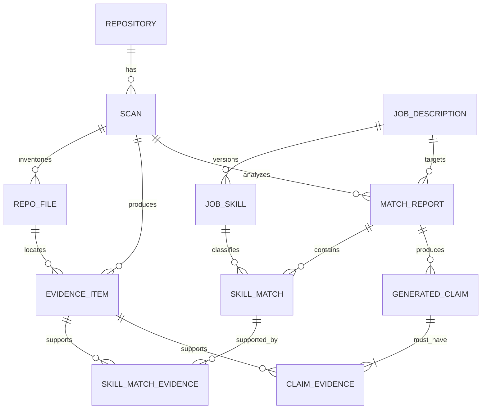

# SkillProof Data Model

**Status:** Accepted for MVP implementation  
**Schema baseline:** `0.1`  
**Database:** PostgreSQL with SQLAlchemy 2 async sessions and Alembic migrations

## 1. Modeling principles

1. A `Scan` is an immutable analysis attempt rooted at one repository commit after resolution.
2. Evidence is append-only after a scan completes and retains exact source provenance.
3. Reports refer to the scan and corrected job-skill revision used to calculate them.
4. Generated claims and their qualifying evidence links are created atomically.
5. Raw repository file contents are not persisted. Only bounded metadata and redacted evidence excerpts are stored.
6. Detector, parser, taxonomy, score, contract, and scan-policy versions are stored with the results they govern.
7. UUID primary keys are internal resource identities; canonical repository and skill identities remain explicit domain fields.

## 2. Relationship overview

`SkillMatchEvidence` is an association needed to explain awarded matches. It is auxiliary to the Phase 1 core-entity list but is not optional in implementation.

## 3. Enumerations

Store enums as constrained strings so values remain readable in migrations and SQL. Adding a value requires an Alembic migration and an API compatibility review.

| Enum | Values |
| --- | --- |
| `scan_status` | `queued`, `running`, `completed`, `failed` |
| `scan_phase` | `queued`, `resolving_repository`, `enumerating_tree`, `fetching_files`, `detecting`, `persisting`, `complete`, `failed` |
| `coverage_state` | `complete`, `partial` |
| `file_purpose` | `manifest`, `source`, `test`, `configuration`, `documentation`, `other` |
| `confidence` | `high`, `medium`, `low` |
| `job_requirement` | `required`, `preferred` |
| `skill_origin` | `parser`, `user` |
| `match_type` | `exact`, `equivalent`, `related`, `missing`, `unverified` |
| `claim_type` | `resume_bullet`, `interview_talking_point` |
| `claim_status` | `active`, `invalidated` |

Evidence-kind values for contract `0.1` are `manifest_dependency`, `import`, `route`, `test`, `component`, `hook`, `configuration`, `language_syntax`, and `documentation_reference`. They are validated by the evidence contract rather than a PostgreSQL enum; any vocabulary change must update the contract/schema and golden expectations under its change-control rules.

## 4. Entity definitions

All timestamps are `TIMESTAMPTZ` in UTC. Unless noted otherwise, foreign keys use `ON DELETE RESTRICT` to protect provenance. All UUIDs are generated by the application or database default consistently.

### 4.1 `repositories`

| Column | Type | Rules |
| --- | --- | --- |
| `id` | UUID | Primary key |
| `provider` | VARCHAR(32) | Required; v1 check is `github` |
| `provider_repository_id` | BIGINT, nullable | GitHub's stable repository ID after resolution |
| `normalized_owner` | VARCHAR(255) | Required; lowercase comparison value |
| `normalized_name` | VARCHAR(255) | Required; lowercase comparison value |
| `display_owner` | VARCHAR(255) | Required; returned display value |
| `display_name` | VARCHAR(255) | Required; returned display value |
| `canonical_url` | TEXT | Required HTTPS URL without suffix/query/fragment |
| `default_branch` | VARCHAR(255), nullable | Last observed branch metadata, never a provenance key |
| `created_at` | TIMESTAMPTZ | Required |
| `updated_at` | TIMESTAMPTZ | Required |

Constraints and indexes:

- Unique `(provider, normalized_owner, normalized_name)`.
- Unique `(provider, provider_repository_id)` when provider ID is not null.
- Canonical API identity is `provider:normalized_owner/normalized_name`.

Repository renames are resolved by provider ID when available; historical scans keep their commit and the repository identity observed for their evidence serialization.

### 4.2 `scans`

| Column | Type | Rules |
| --- | --- | --- |
| `id` | UUID | Primary key |
| `repository_id` | UUID | FK to `repositories.id`, indexed |
| `status` | `scan_status` | Required |
| `phase` | `scan_phase` | Required |
| `commit_sha` | VARCHAR(64), nullable | Full immutable Git SHA; required for completed status |
| `detector_version` | VARCHAR(32) | Required, for example `0.1.0` |
| `taxonomy_version` | VARCHAR(32) | Required |
| `redaction_version` | VARCHAR(32) | Required |
| `evidence_contract_version` | VARCHAR(16) | Required; initial value `0.1` |
| `scan_policy_version` | VARCHAR(16) | Required |
| `scan_policy_snapshot` | JSONB | Required validated copy of all numeric policy limits |
| `scan_policy_observations` | JSONB | Required validated request/tree/file/byte/concurrency counters |
| `coverage_state` | `coverage_state`, nullable | Present only for completed status |
| `coverage_reasons` | JSONB | Required array of approved reason-code strings; default `[]` |
| `files_discovered` | INTEGER | Required nonnegative; default `0` |
| `files_inspected` | INTEGER | Required nonnegative; default `0` |
| `files_skipped_by_policy` | INTEGER | Required nonnegative; default `0` |
| `bytes_inspected` | BIGINT | Required nonnegative; default `0` |
| `failure_code` | VARCHAR(64), nullable | Stable safe code for failed status |
| `failure_message` | TEXT, nullable | Safe display message; no upstream payload |
| `created_at` | TIMESTAMPTZ | Required |
| `started_at` | TIMESTAMPTZ, nullable | Set on transition to running |
| `completed_at` | TIMESTAMPTZ, nullable | Set for completed or failed terminal state |

State checks:

- `completed` requires `commit_sha`, `coverage_state`, `started_at`, `completed_at`, and no failure code.
- `failed` requires `failure_code` and `completed_at`, and has `coverage_state=null`.
- `queued` has no start/completion time; `running` has a start but no completion time.
- `coverage_reasons` is empty for complete coverage and non-empty for partial coverage.
- A unique constraint is intentionally not placed on the semantic scan tuple because attempts and failures are auditable. Index `(repository_id, commit_sha, detector_version, taxonomy_version, redaction_version, evidence_contract_version, scan_policy_version, status)` supports safe completed-result lookup; the service additionally compares the stored policy snapshot.

Terminal scan input/version columns and coverage are immutable. A retry is a new row.

Scan-policy `0.1` snapshots 50 GitHub requests, 10,000 evaluated tree entries, 40 file blobs, 256 KiB per file, 5 MiB aggregate file bytes, concurrency 5, and a 10-second outbound timeout. `scan_policy_observations` records the corresponding observed counters so every partial reason is explainable.

### 4.3 `repo_files`

| Column | Type | Rules |
| --- | --- | --- |
| `id` | UUID | Primary key |
| `scan_id` | UUID | FK to `scans.id`, indexed |
| `path` | TEXT | Required normalized repository-relative POSIX path |
| `git_blob_sha` | VARCHAR(64), nullable | Provider blob identity if available |
| `size_bytes` | BIGINT | Required nonnegative |
| `purpose` | `file_purpose` | Required |
| `inspected` | BOOLEAN | Required |
| `skip_reason` | VARCHAR(64), nullable | Required when an enumerated file is not inspected |
| `content_hash` | CHAR(64), nullable | SHA-256 hex of the exact inspected file bytes |
| `created_at` | TIMESTAMPTZ | Required |

Constraints:

- Unique `(scan_id, path)`.
- `inspected=true` requires `content_hash` and no `skip_reason`.
- `inspected=false` requires `skip_reason`; it has no content hash.
- File contents are never stored in this table.

### 4.4 `evidence_items`

| Column | Type | Rules |
| --- | --- | --- |
| `id` | UUID | Primary key |
| `scan_id` | UUID | FK to `scans.id`, indexed |
| `repo_file_id` | UUID | FK to `repo_files.id`, indexed |
| `canonical_skill_id` | VARCHAR(128) | Required normalized taxonomy ID |
| `rule_id` | VARCHAR(255) | Required stable detector rule ID |
| `detector_version` | VARCHAR(32) | Required; must equal owning scan version |
| `evidence_kind` | VARCHAR(64) | Required contract-approved value |
| `confidence` | `confidence` | Required |
| `start_line` | INTEGER | Required, one-based, greater than zero |
| `end_line` | INTEGER | Required, one-based and not less than start |
| `source_content_hash` | CHAR(64) | Required; must equal the inspected file content hash |
| `redacted_excerpt` | TEXT | Required bounded plain text; at least one character |
| `created_at` | TIMESTAMPTZ | Required |

Constraints and indexes:

- The service validates that scan and file belong together and that source hash and detector versions match; these are asserted in integration tests.
- Unique `(scan_id, repo_file_id, canonical_skill_id, rule_id, start_line, end_line)` prevents duplicate semantic evidence.
- Index `(scan_id, canonical_skill_id, confidence)` supports evidence filtering.
- Completed evidence is append-only. Evidence referenced by a match or claim cannot be deleted.

The serialized contract derives `repository` and `commit_sha` from Repository/Scan, `path` and `content_hash` from RepoFile/EvidenceItem, and `coverage_state` from Scan so each API item remains self-contained without inconsistent duplicate storage. File hashes are calculated before text decoding/redaction; original line-ending bytes therefore remain significant.

`claim_eligible` is derived as: owning scan is completed, evidence passes contract `0.1`, confidence is high or medium, and kind is not `documentation_reference`. Partial coverage does not invalidate positive observed evidence; it changes how absence is reported.

### 4.5 `job_descriptions`

| Column | Type | Rules |
| --- | --- | --- |
| `id` | UUID | Primary key |
| `title` | VARCHAR(200), nullable | Optional |
| `company` | VARCHAR(200), nullable | Optional |
| `text` | TEXT | Required, 50..20,000 Unicode characters after blank check |
| `parser_version` | VARCHAR(32) | Required |
| `taxonomy_version` | VARCHAR(32) | Required |
| `revision` | INTEGER | Required, begins at `1` |
| `confirmed_revision` | INTEGER, nullable | Equals current revision only after explicit confirmation |
| `created_at` | TIMESTAMPTZ | Required |
| `updated_at` | TIMESTAMPTZ | Required |

The original text remains stable. Correcting skills increments `revision` and inserts a new immutable skill revision. `confirmed_revision=revision` is the report precondition.

### 4.6 `job_skills`

| Column | Type | Rules |
| --- | --- | --- |
| `id` | UUID | Primary key |
| `job_description_id` | UUID | FK to `job_descriptions.id`, indexed |
| `revision` | INTEGER | Required; identifies the parent skill-list revision |
| `canonical_skill_id` | VARCHAR(128) | Required taxonomy ID |
| `display_name` | VARCHAR(200) | Required snapshot from taxonomy |
| `requirement` | `job_requirement` | Required |
| `source_sentence` | TEXT, nullable | Bounded source context |
| `origin` | `skill_origin` | Required |
| `created_at` | TIMESTAMPTZ | Required |

Unique `(job_description_id, revision, canonical_skill_id, requirement)`. Old revisions are retained so existing reports remain reproducible. Only the current revision is returned by default.

### 4.7 `match_reports`

| Column | Type | Rules |
| --- | --- | --- |
| `id` | UUID | Primary key |
| `scan_id` | UUID | FK to completed `scans.id`, indexed |
| `job_description_id` | UUID | FK to `job_descriptions.id`, indexed |
| `job_description_revision` | INTEGER | Required confirmed revision snapshot |
| `taxonomy_version` | VARCHAR(32) | Required taxonomy snapshot |
| `matcher_version` | VARCHAR(32) | Required matching-rule snapshot |
| `job_fit_score` | NUMERIC(5,2) | Required, `0..100` |
| `job_fit_version` | VARCHAR(16) | Required |
| `required_coverage` | NUMERIC(5,2), nullable | `0..100`; null when no required skills exist |
| `preferred_coverage` | NUMERIC(5,2), nullable | `0..100`; null when no preferred skills exist |
| `portfolio_quality_score` | NUMERIC(5,2) | Required, `0..100` |
| `portfolio_quality_version` | VARCHAR(16) | Required |
| `portfolio_quality_components` | JSONB | Required schema-validated component snapshot |
| `warnings` | JSONB | Required array of stable warning codes |
| `created_at` | TIMESTAMPTZ | Required |

Reports are immutable. A report from partial coverage includes `PARTIAL_SCAN` and does not classify unobserved requirements as definitively missing. At least one coverage class is non-null. When both classes exist, Job Fit weights required/preferred coverage 80/20; when only one exists, that class supplies 100%.

No combined score column is permitted.

### 4.8 `skill_matches`

| Column | Type | Rules |
| --- | --- | --- |
| `id` | UUID | Primary key |
| `match_report_id` | UUID | FK to `match_reports.id`, indexed |
| `job_skill_id` | UUID | FK to the exact retained `job_skills.id` |
| `match_type` | `match_type` | Required |
| `normalized_job_skill` | VARCHAR(128) | Required matcher input term |
| `normalized_repository_skill` | VARCHAR(128), nullable | Matched canonical/equivalent term when observed |
| `awarded` | BOOLEAN | Required |
| `reason` | TEXT | Required safe explanation |
| `score_contribution` | NUMERIC(5,2) | Required, nonnegative |
| `created_at` | TIMESTAMPTZ | Required |

Unique `(match_report_id, job_skill_id)`. `awarded=true` is allowed only for `exact` or approved `equivalent` matches with at least one qualifying `SkillMatchEvidence` row. Related, missing, and unverified matches have contribution zero.

### 4.9 `skill_match_evidence`

| Column | Type | Rules |
| --- | --- | --- |
| `skill_match_id` | UUID | FK to `skill_matches.id`; composite primary key |
| `evidence_item_id` | UUID | FK to `evidence_items.id`; composite primary key |
| `created_at` | TIMESTAMPTZ | Required |

The evidence must belong to the report's scan and must be claim-eligible when `awarded=true`. The report service verifies this before commit.

### 4.10 `generated_claims`

| Column | Type | Rules |
| --- | --- | --- |
| `id` | UUID | Primary key |
| `match_report_id` | UUID | FK to `match_reports.id`, indexed |
| `scan_id` | UUID | FK to the report's `scans.id`, indexed |
| `claim_type` | `claim_type` | Required |
| `text` | TEXT | Required bounded plain text |
| `generation_rule_version` | VARCHAR(32) | Required deterministic template/rule version |
| `status` | `claim_status` | Required; initial `active` |
| `invalidated_at` | TIMESTAMPTZ, nullable | Required only for invalidated status |
| `created_at` | TIMESTAMPTZ | Required |

The application does not insert a claim row by itself. The claim service writes the claim and one or more associations in one transaction, verifies that `scan_id` equals the report scan, checks the post-condition, and rolls back the whole unit when no qualifying evidence exists.

### 4.11 `claim_evidence`

| Column | Type | Rules |
| --- | --- | --- |
| `generated_claim_id` | UUID | FK to `generated_claims.id`; composite primary key |
| `evidence_item_id` | UUID | FK to `evidence_items.id`; composite primary key |
| `created_at` | TIMESTAMPTZ | Required |

The evidence must belong to the claim report's scan and be claim-eligible. Evidence-row deletion is restricted. Claim-evidence links may be removed only through the claim service; removing or invalidating the final qualifying link atomically transitions the claim to `invalidated`, so it is excluded from usable output while history remains auditable.

## 5. Cross-entity invariants

These checks belong in domain services and integration tests; database foreign keys/checks enforce the portions expressible locally.

1. Every completed scan has one repository and one immutable commit SHA.
2. Every evidence item refers to an inspected file in the same scan, with matching content hash and detector version.
3. Evidence line ranges are within the normalized file line count captured during ingestion validation.
4. Redaction happens before `EvidenceItem` construction; raw secret-like values cannot reach persistence or logs.
5. A match report uses a completed scan and the job description's confirmed revision.
6. Every awarded skill match has qualifying evidence from the same scan.
7. Every active generated claim has at least one qualifying evidence association from the report scan.
8. README-only/low-confidence evidence can be displayed but cannot award a match or support a claim.
9. Partial coverage propagates to reports and prevents unsupported observations from becoming definitive absence.
10. Job Fit and Portfolio Quality have independent values and version fields; no aggregate is persisted.

## 6. Transaction boundaries

- **Start scan:** upsert normalized repository, insert queued scan, commit, then schedule work.
- **Run scan:** short transaction for running state; network retrieval outside a write transaction; controlled batch/file/evidence writes; terminal transition committed last.
- **Correct job skills:** lock the job-description row, compare expected revision, increment, insert the full new skill set, set confirmed revision, commit atomically.
- **Create report:** read one completed scan and one confirmed job revision; calculate; insert report, matches, evidence links, claims, and claim links in one transaction.
- A failed transaction produces no partially supported claim or report.

## 7. Migration and test strategy

- Alembic revision `0001` creates enums/tables/constraints/indexes in dependency order. Downgrade removes them in reverse order for local/test use.
- CI creates an empty PostgreSQL database, upgrades from base to head, validates schema, and runs the integration suite. A second check upgrades from the previous release head when one exists.
- Model tests cover all state checks, uniqueness rules, delete restrictions, revision conflicts, cross-scan evidence rejection, claim-without-evidence rollback, and score ranges.
- No application startup path calls `create_all`; all environment schemas are migration-managed.

## Related notes

- [[Home]]
- [[MOCs/Engineering MOC]]
- [[inception/ARCHITECTURE]]
- [[inception/EVIDENCE_CONTRACT]]
